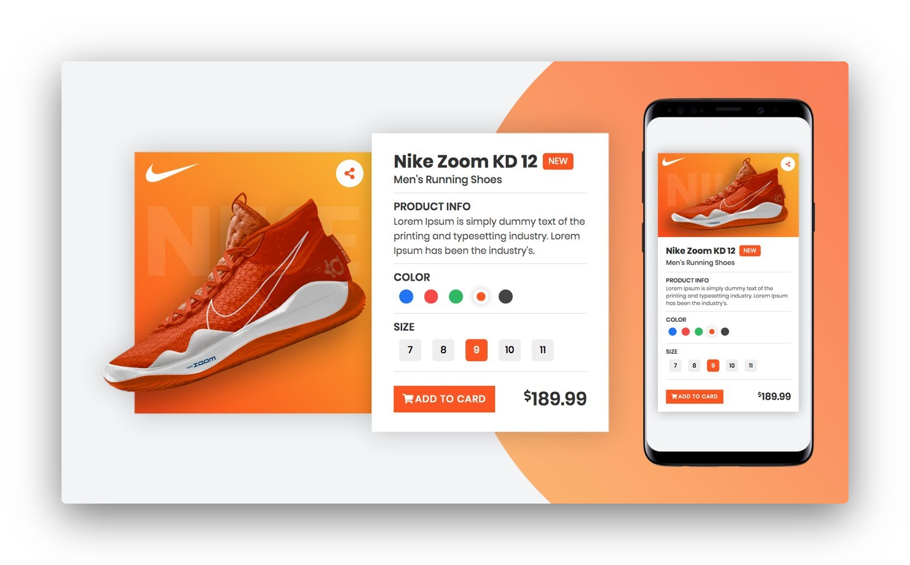

<div align="center"> 
  

  <p>
    Responsive and animated product card made with HTML, CSS and JavaScript.
  </p>
</div>

## Features

- [x] Selection of product colors.
- [x] Counter added to the product cart.

## Getting Started

Cloning the repository

```
git clone https://github.com/fariasmateuss/product.git
```

Open the website on localhost or your network address.

## Contribution

You can send how many PR's do you want, I'll be glad to analyse and accept them! And if you have any question about the project...

Connect with me at [LinkedIn](https://www.linkedin.com/in/fariasmateuss/)

Thank you!

# License

[MIT License](/LICENSE)
